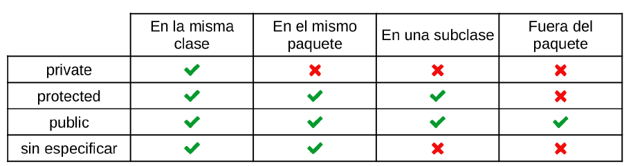

# 05. Control de Flujo.


Asegurarse que se está en el directorio ***java_poo_jsp_mvn/08_POO***.

La ***programación orientada a objetos*** es un paradigma de programación que se basa, como su nombre indica, en la utilización de objetos. Estos objetos también se suelen llamar ***instancias***.

Un objeto en términos de POO no se diferencia mucho de lo que conocemos como un objeto en la vida real. Pensemos por ejemplo en un coche. Nuestro coche sería un objeto concreto de la vida real, igual que el coche del vecino, o el coche de un compañero de trabajo.

Todos esos coches son objetos concretos que podemos ver y tocar. Tanto mi coche como el coche del vecino tienen algo en común, ambos son coches.

En este caso mi coche y el coche del vecino serían ***instancias*** (objetos) y coche (asecas) sería una ***clase***. La palabra coche (la clase) define algo genérico, es una abstracción, no es un coche concreto sino que hace referencia a unos elementos que tienen una serie de propiedades como ***matrícula***, ***marca***, ***modelo***, ***color***, etc.; este conjunto depropiedades se denominan ***atributos*** o ***variables de instancia***.

En Java, los nombres de las ***clases*** se escriben con la ***primera letra en mayúscula*** mientras que los nombres de las ***instancias*** comienzan con una ***letra en minúscula***. Por ejemplo, la clase coche se escribe en Java como ***Coche*** y el objeto "mi coche" se podría escribir como ***miCoche***.

Vamos a definir a continuación la clase ***Libro*** con los atributos ***isbn***, ***autor***, ***titulo*** y ***numeroPaginas***.


Abrimos con VSC el archivo ***Libro.java*** y lo estudiamos.

```
code ./ejemplo_01/Libro.java
```

Ahora creamos otro archivo para probar la clase.

Abrimos con VSC el archivo ***PruebaLibro.java*** y lo estudiamos.

```
code ./PruebaLibro.java
```

Compilamos el programa y observamos la salida en la terminal.

Uno de los pilares en los que se basa la Programación Orientada a Objetos es el ***encapsulamiento***. Básicamente, el encapsulamiento consiste en definir todas las propiedades y el comportamiento de una clase dentro de esa clase; es decir, en la clase ***Coche*** estará definido todo lo concerniente a la clase ***Coche*** y en la clase ***Libro*** estará definido todo lo que tenga que ver con la clase ***Libro***.

La ***ocultación*** es una técnica que incorporan algunos lenguajes (entre ellos Java) que permite esconder los elementos que definen una clase, de tal forma que desde otra clase distinta no se pueden “ver las tripas” de la primera. La ocultación facilita, como veremos más adelante, el encapsulamiento.

Un coche ***arranca***, ***para***, ***se aparca***, hace ***sonar el claxon***, se puede ***llevar a reparar***. Un gato puede ***comer***, ***dormir***, ***maullar***, ***ronronear***. Las acciones asociadas a una clase se llaman ***métodos***. Estos métodos se definen dentro del cuerpo de la clase y se suelen colocar a continuación de los atributos.

Vamos a crear la clase ***GatoSimple***. Para saber qué atributos debe tener esta clase hay que preguntarse qué características tienen los gatos. Todos los gatos son de un ***color*** determinado, pertenecen a una ***raza***, tienen una ***edad***, tienen un determinado ***sexo*** - son machos o hembras - y tienen un ***peso*** que se puede expresar en kilogramos. Éstos serán por tanto los ***atributos*** que tendrá la clase ***GatoSimple***.

Para saber qué ***metodos*** debemos implementar hay que preguntarse qué acciones están asociadas a los gatos. Bien, pues los gatos ***maullan***, ***ronronean***, ***comen*** y si son machos se ***pelean*** entre ellos. Esos serán los métodos que definamos en la clase.

Abrimos con VSC el archivo ***GatoSimple.java*** y lo estudiamos.

```
code ./ejemplo_02/GatoSimple.java
```

Vamos a probar la clase.

Abrimos con VSC el archivo ***PruebaGatoSimple.java*** y lo estudiamos.

```
code ./PruebaGatoSimple.java
```

Compilamos el programa y observamos la salida en la terminal.


Los métodos getter y setter son ampliamente utilizados en Java. Vamos a explicarlos con la clase Cubo. 

Para saber qué atributos se deben definir, nos preguntamos qué características tienen los cubos. Todos los cubos tienen una determinada ***capacidad***, un ***color***, están hechos de un determinado ***material***.

Un cubo se fabrica con el propósito de contener líquido; por tanto otra característica es la cantidad de litros de líquido que ***contiene*** en un momento determinado. Por ahora, solo nos interesa saber la ***capacidad máxima*** y los litros que ***contiene*** el cubo en cada momento, así que esos serán los atributos que tendremos en cuenta.

Abrimos con VSC el archivo ***Cubo.java*** y lo estudiamos.

```
code ./ejemplo_03/Cubo.java
```

Vamos a probar la clase.

Abrimos con VSC el archivo ***PruebaCubo.java*** y lo estudiamos.

```
code ./PruebaCubo.java
```

Compilamos el programa y observamos la salida en la terminal.


El método ***toString()*** es muy importante implementarlo en tus clases. 

La definición de la clase ***Cubo*** contiene el método ***pinta*** que, como su nombre indica, permite pintar en pantalla un objeto de esa clase. En Java existe una solución muy elegante para mostrar información sobre un objeto por pantalla. 

Si se quiere mostrar el contenido de la variable entera ***x*** se utiliza ***System.out.print(x)*** y si se quiere mostrar el valor de la variable de tipo cadena de caracteres nombre se escribe ****System.out.print(nombre)***. De la misma manera, si se quiere
mostrar el objeto ***miPiramide*** que pertenece a la clase ***Piramide***, también se podría usar ***System.out.print(miPiramide)***. 

Java sabe perfectamente cómo mostrar números y cadenas de caracteres pero no sabe a priori cómo se pintan pirámides. Para indicar a Java cómo debe pintar un objeto de la clase ***Piramide ***basta con implementar el método ***toString*** dentro de la clase.
Veamos un ejemplo muy sencillo de implementación de toString. Definiremos la clase ***Cuadrado*** con el atributo ***lado***, el ***constructor*** y el método ***toString()***.

Abrimos con VSC el archivo ***Cuadrado.java*** y lo estudiamos.

```
code ./ejemplo_04/Cuadrado.java
```


Vamos a probar la clase.

Abrimos con VSC el archivo ***PruebaCuadrado.java*** y lo estudiamos.

```
code ./PruebaCuadrado.java
```

Compilamos el programa y observamos la salida en la terminal.


Al definir los elementos de una clase, se pueden especificar sus ámbitos (scope) de visibilidad o accesibilidad con las palabras reservadas ***public***, ***protected*** y ***private***.

Estudia la siguiente tabla.




[Vamos al siguiente capítulo](../09)

