# Acceso a base de datos H2 con Maven.

Nota importante. Si se ha realizado esta práctica anteriormente, en el directorio del usuario ***C:\Users\antonio***, aparecerá un archivo llamado ***test.mv.db*** y otro llamado ***test.trace.db***. Borrar ambos archivos.


## 01. ¿Qué es una base de datos H2?

Es un motor de base de datos SQL escrito en Java. Sus características más importantes son:

* Es Open Source, muy rápido y compatible con la API JDBC.
* Tiene la capacidad de crear BBDD en memoria, por lo que es muy apropiado para entornos de formación o PoC.
* Dispone de una consola de administración con interfaz web.
* Ocupa muy poco. El archivo ***jar*** ocupa alrededor de 2.5 MB.
* Puede ser incrustado en las aplicaciones Java.

## 02. Descarga de H2.

H2 se descarga de la siguiente url:
```
https://h2database.com/html/main.html
```

Debemos descargar la versión comprimida, que es multiplataforma.

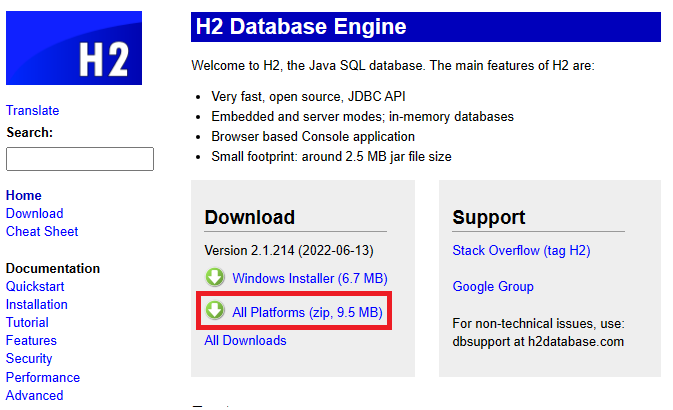

Descomprímela y mueve la carpeta descomprimida a la ruta ***C:\Archivos de programa\Java***. Luego localiza el ejecutable (archivo jar) de H2, como muestra la imagen.
(Nota: La versión de H2 descargada puede ser diferente)

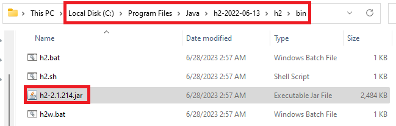

## 03. Usar la consola web de H2.

Para poder acceder a la consola web  de H2 y gestionar las bases de datos SQL debemos iniciarla.

Para ello, abrimos una consola de comandos, y cambiamos al directorio donde hemos descargado el jar de H2.
(Nota: la ruta puede ser diferente. Es mejor usar el Explorador de archivos y copiar el path a la carpeta ***bin***)

```
cd "C:\Program Files\Java\h2-2022-06-13\h2\bin"
```


Iniciamos la consola web de H2 con el siguiente comando.
(Nota: En nombre del archivo jar puede ser de una version diferente)

```
java -jar h2-2.1.214.jar
```

El navegador abrirá la consola web de H2. Observa como se va a conectar a una base de datos llamada ***test*** (En el directorio por defecto del usuario). Debes poner una contraseña para acceder de aquí en adelante. Te recomiendo poner ***Pa55w.rd***.

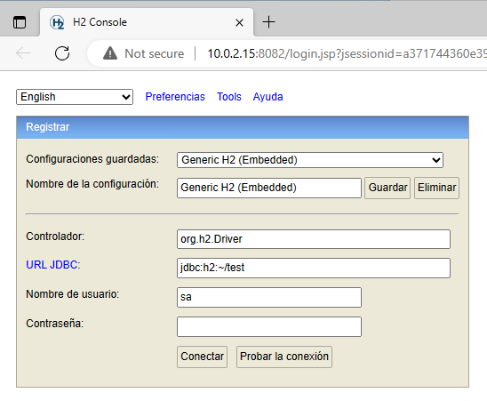

Ma minimizamos para usarla en breve.

Se abrirá la consola de administración de H2.


Vamos a proceder a crear una pequeña tabla. Para ello, en el campo ***SQL statement***, pegamos el siguiente comando.

```
create table alumnos (ID int primary key, Nombre varchar(48), Apellidos varchar(48));
```

Haz clic en el botón ***Ejecutar***.

Como podrás comprobar, se ha creado la tabla con sus tres columnas.

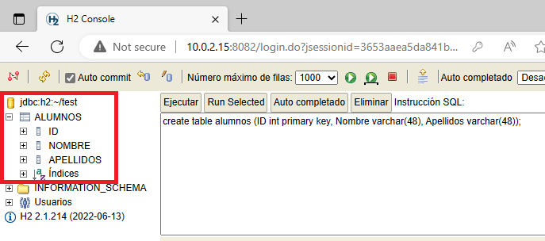

Prueba a dar de alta un par de alumnos. Para ello puedes ejecutar el siguiente código SQL.

```
insert into alumnos values (1, 'Jaime', 'Tralleta');
insert into alumnos values (2, 'Andrés', 'Trozado');
insert into alumnos values (3, 'Aitor', 'Menta');
insert into alumnos values (4, 'Dolores', 'Fuertes de Barriga');
```

Comprueba que los registros se han añadido.

```
select * from alumnos;
```

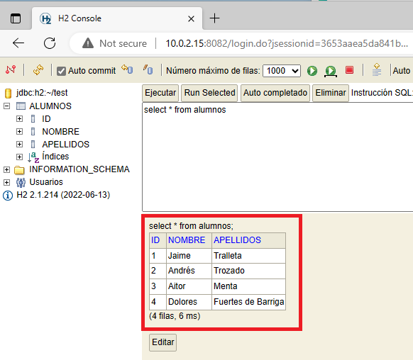

## 4. Conectar con una base de datos H2 usando Maven.

En primer lugar, en Eclipse creamos un nuevo ***Proyecto de Maven***. 

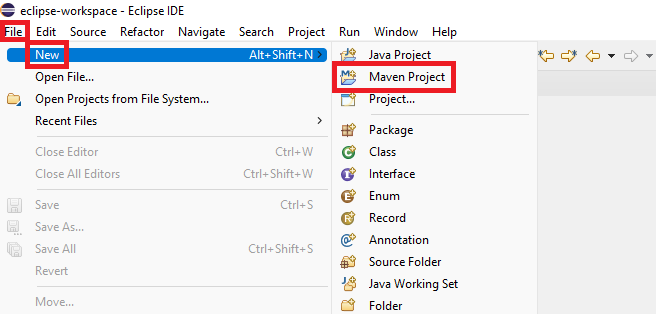

En la ventana ***New Maven Project***, nos aseguramos de marcar el check box ***Create a simple project (skip archetype selection)*** y hacemos clic en ***Next***.

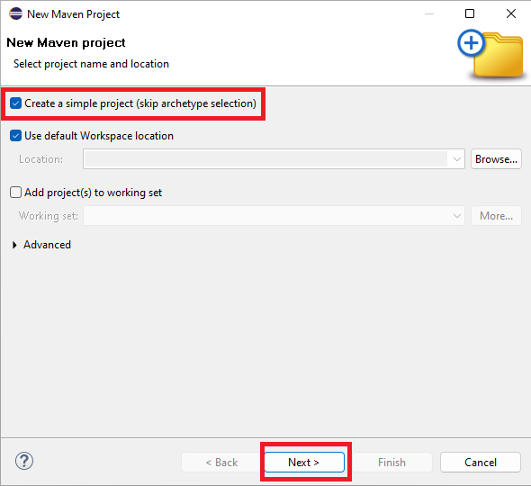

En la ventana de configuración del proyecto Maven, rellenamos los campos tal y como se muestran en la siguiente imagen. A continuación hacemos clic en ***Finish***.

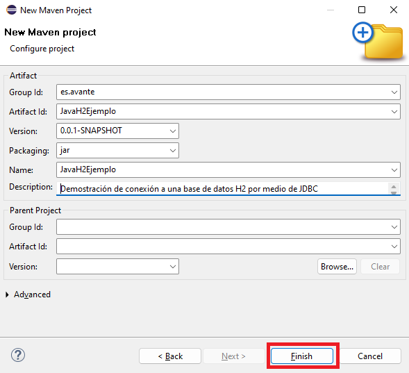

Como puedes observar en la imagen. El archivo ***pom.xml*** es fundamental en un proyecto Maven, ya que contiene toda la configuración. 

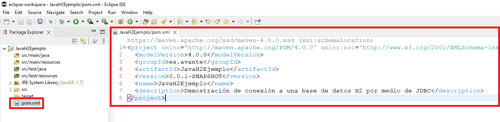

Lo que vas a aprender ahora es la razón por la que Maven es tan utilizado: Necesitamos decirle al proyecto que deseamos conectar con una base de datos H2. Maven automatiza todas las descargas necesarias para cumplir ese requisito. Para ello, debemos crear una ***dependencia***, que quiere decir precísamente eso: "Nuestro proyecto depende de la conexiónn JDBC con una base de datos H2".

El procedimiento es siempre el mismo. Como necesitas la dependencia de H2, entonces deber ir a la web de H2 y buscar la información de la dependencia que debes ponerle a Maven. En el siguiente enlace tienes la dependencia que necesitas.

```
https://www.h2database.com/html/cheatSheet.html
```

El link anterior nos lleva a la siguiente página.

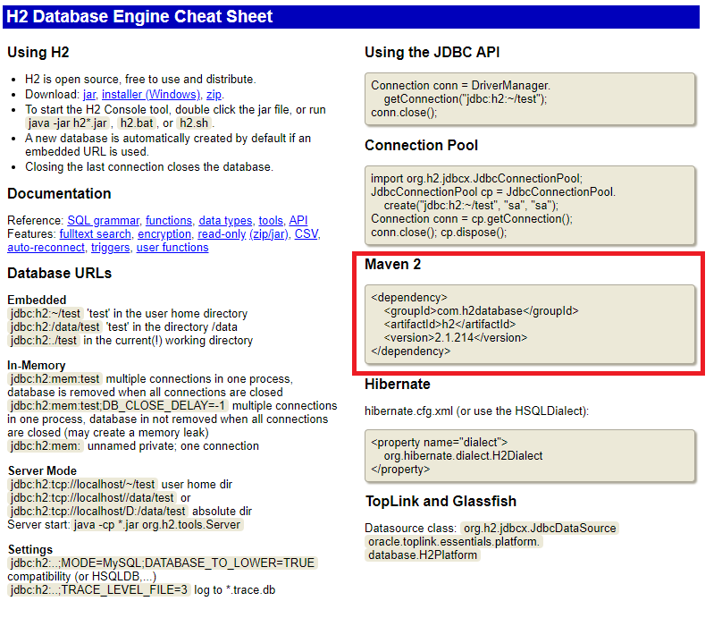

Ahora debes copiar la dependencia y pegarla al final del archivo ***pom.xml***. Estudia la siguiente imagen porque es muy importante que lo hagas bien.

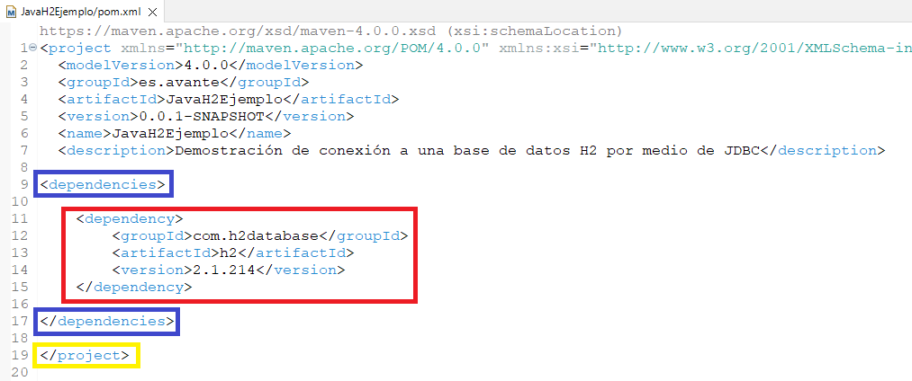

La etiqueta ***/project***, señalada en color amarillo, la hemos desplazado hacia abajo para ganar espacio dentro del arcrivo ***pom.xml***.

debes creaar una sección nueva, escribiendo las etiquetas de color azul ***dependencies*** y ***/dependencies***. También deja un hueco de unas cuantas líneas.

Pues bien, como en el portapapeles debes tener aún almacenada la dependencia de H2, lo único que debes hacer ahora es pegarla, en la imagen anterior puedes ver el resultado en el recuadro de color rojo.

Cuando hayas terminado,verás como el proyecto registra la dependencia de Maven que hemos registrado.

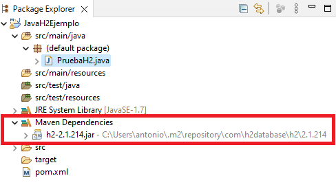


Ahora vamos a proceder a crear una nueva clase de Java para verlo todo funcionando.

Crear una clase nueva y configúrala como ves en la siguiente imagen. Haz clic en ***Finish***

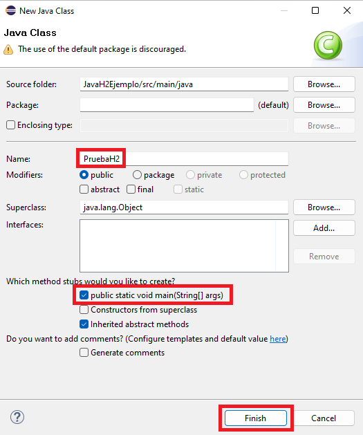

Es el momento de realizar la primera prueba. Sustituye todo el contenido del archivo ***PruebaH2.java*** por el siguiente.

```
import java.sql.Connection;     // Clase para poder interactuar con la base de datos.
import java.sql.DriverManager;  // Clase para poder conectar con la base de datos.
import java.sql.SQLException;   // Clase para controlar los errores de SQL.

public class PruebaH2 {
    public static void main(String[] args) {
        String jdbcURL = "jdbc:h2:~/test";  // Esta es la ruta de la base de datos "test" que creamos antes.
        String user = "sa";                 // Nombre de usuario administrador de H2.
        String password = "Pa55w.rd";       // Contraseña.
		
        // Siempre usamos control de excepciones al conectar con la base de datos.
        try {
            // Instancio un objeto de Connection y conecto con la base de datos H2.
            Connection connection = DriverManager.getConnection(jdbcURL, user, password);
			
            // Si no hay errores, indico que la conexión es correcta.
            System.out.println("Conexión realizada con éxito");
			
        // Si hay errores, lo caza SQLException
        } catch(SQLException e) {
            System.out.println("Se ha producido un error al conectar con H2. El error es: ");
            
            // Imprimo el volcado de pila.
            e.printStackTrace();
        }
    }
}
```

Muy importante: Si tienes la base de datos abierta con la consola web, al ejecutar el programa te dará un error porque el archivo está bloqueado. 

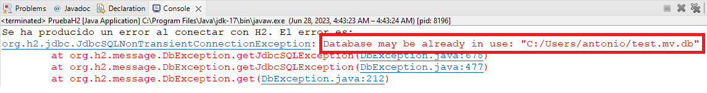

Asegurate que has cerrado la ventana de la consola web de H2 con ***CTRL+C*** antes de continuar.

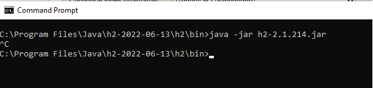

Al ejecutar tu programa Java, debe aparecer el mensaje de conexión correcta.

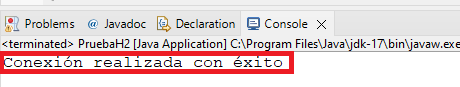


## 5. Realizar operaciones CRUD a través de JDBC con la base de datos H2.

En esta última parte vamos a ver cómo se realizan las operaciones CRUD (Create, Read, Update y Delete) en la base de datos usando JDBC.

Para ello, sustituye todo el contenido del archivo ***PruebaH2.java*** por el que se muestra a continuación.

```
import java.sql.Connection;     // Clase para poder interactuar con la base de datos.
import java.sql.DriverManager;  // Clase para poder conectar con la base de datos.
import java.sql.SQLException;   // Clase para controlar los errores de SQL.
import java.sql.Statement;      // Clase para preparar las sentencias SQL.
import java.sql.ResultSet;      // Clase para consultas de selección.


public class PruebaH2 {
    public static void main(String[] args) {
	    String jdbcURL = "jdbc:h2:~/test";  // Esta es la ruta de la base de datos "test" que creamos antes.
        String user = "sa";                 // Nombre de usuario administrador de H2.
        String password = "Pa55w.rd";       // Contraseña.
		
        // Siempre usamos control de excepciones al conectar con la base de datos.
        try {
            // Instancio un objeto de Connection y conecto con la base de datos H2.
            Connection connection = DriverManager.getConnection(jdbcURL, user, password);
			
            // Si no hay errores, indico que la conexión es correcta.
            System.out.println("Conexión realizada con éxito");
			
            
            // Leo la tabla alumnos.
            leeAlumnos(connection);
            
            // Añado un alumno
            añadeAlumno(connection, 6, "Amanda", "Da Pena");
            
            // Leo la tabla alumnos.
            leeAlumnos(connection);       
            
            // Elimino alumno.
            eliminaAlumno(connection, 6);
            
            // Leo la tabla alumnos.
            leeAlumnos(connection);
            
            // Actualizo los apellidos de un alumnno.
            actualizaApellidosAlumno(connection, 3, "Menta Fuerte");
            
            // Leo la tabla alumnos.
            leeAlumnos(connection);
            
            // Cierro conexión con BD.
            connection.close();
			
        // Si hay errores, lo caza SQLException
        } catch(SQLException e) {
            System.out.println("Se ha producido un error de SQL El error es: ");
            e.printStackTrace();
        }
    }
    
    public static void leeAlumnos(Connection connection) throws SQLException {
    	// Creo objeto Statement para preparar la consulta.
        Statement statement = connection.createStatement();
        
        // Instrucción de selección.
        String sql = "select * from alumnos";
        
        // Instancio Resulset para leer los registros.
        ResultSet resultSet = statement.executeQuery(sql);
        
        // Inicializo la cuentas de registros del resultSet.
        int totalRecords = 0;
        
        // Itero el resultSet.
        while (resultSet.next()) {
            // Incremento el contador de registros.
            totalRecords++;
        	
            // Leo la columna 'ID', que es de tipo entero.
            int id = resultSet.getInt("id");
        	
            // Leo la columna 'Nombre', que es un varchar.
            String nombre = resultSet.getString("Nombre");

            // Leo la columna 'Apellidos', que es un varchar.
            String apellidos = resultSet.getString("Apellidos");
        	
            // Imprimo registro.
            System.out.println("Alumno #" + id + ": " + nombre + " " + apellidos);
        }
        
        System.out.println("Total alumnos: " + totalRecords);	
    }
    
    
    public static void añadeAlumno(Connection connection, 
    		                        int id, 
    		                        String nombre, 
    		                        String apellidos) throws SQLException {
    	
    	// Creo objeto Statement para preparar la consulta.
        Statement statement = connection.createStatement();
        
        String sql = "insert into alumnos values (" + id + "," + "'" + nombre + "'" + "," + "'" + apellidos + "')";
		
        // Ejecuto operación.
        int affectedRows = statement.executeUpdate(sql);
        
        // Comprobación.
        if (affectedRows > 0) {
        	System.out.println("Se ha eliminado un registro.");
        }
    }
    
    public static void eliminaAlumno(Connection connection, int id) throws SQLException {

        // Creo objeto Statement para preparar la consulta.
        Statement statement = connection.createStatement();

        String sql = "delete from Alumnos where id=" + id;

        // Ejecuto operación.
        int affectedRows = statement.executeUpdate(sql);

        // Comprobación.
        if (affectedRows > 0) {
            System.out.println("Se ha insertado un registro.");
        }
    }
    
    public static void actualizaApellidosAlumno(Connection connection, 
    		                                    int id, 
    		                                    String apellidos) throws SQLException {

        // Creo objeto Statement para preparar la consulta.
        Statement statement = connection.createStatement();

        String sql = "update Alumnos set apellidos=" + "'" + apellidos + "' where id=" + id;

        // Ejecuto operación.
        int affectedRows = statement.executeUpdate(sql);

        // Comprobación.
        if (affectedRows > 0) {
            System.out.println("Se ha actualizado un registro.");
        }
    }
}
```


