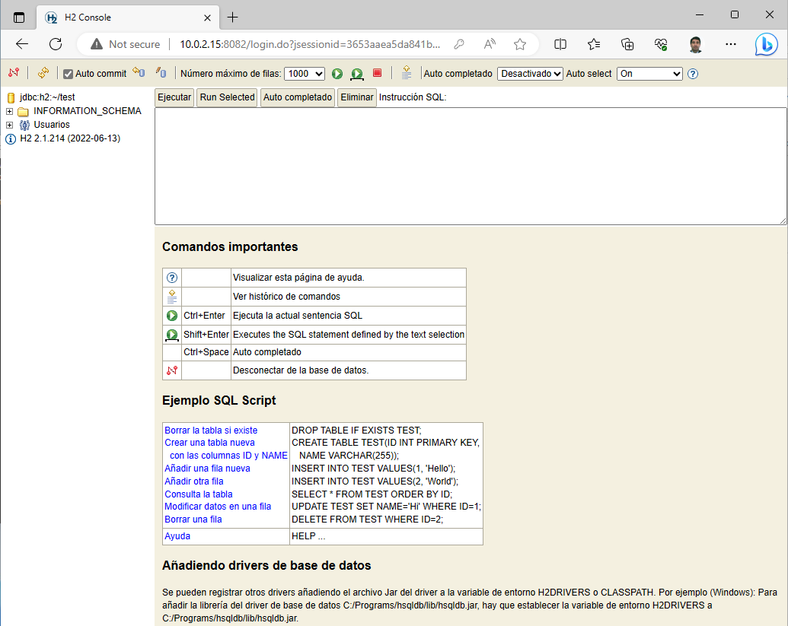

# Acceso a base de datos H2 con Maven.

## 01. ¿Qué es una base de datos H2?

Es un motor de base de datos SQL escrito en Java. Sus características más importantes son:

* Es Open Source, muy rápido y compatible con la API JDBC.
* Tiene la capacidad de crear BBDD en memoria, por lo que es muy apropiado para entornos de formación o PoC.
* Dispone de una consola de administración con interfaz web.
* Ocupa muy poco. El archivo ***jar*** ocupa alrededor de 2.5 MB.
* Puede ser incrustado en las aplicaciones Java.

## 02. Descarga de H2.

H2 se descarga de la siguiente url:
```
https://h2database.com/html/main.html
```

Debemos descargar la versión comprimida, que es multiplataforma.


Descomprímela y mueve la carpeta descomprimida a la ruta ***C:\Archivos de programa\Java***. Luego localiza el ejecutable (archivo jar) de H2, como muestra la imagen.
(Nota: La versión de H2 descargada puede ser diferente)


## 03. Usar la consola web de H2.

Para poder acceder a la consola web  de H2 y gestionar las bases de datos SQL debemos iniciarla.

Para ello, abrimos una consola de comandos, y cambiamos al directorio donde hemos descargado el jar de H2.
(Nota: la ruta puede ser diferente. Es mejor usar el Explorador de archivos y copiar el path a la carpeta ***bin***)

```
cd "C:\Program Files\Java\h2-2022-06-13\h2\bin"
```


Iniciamos la consola web de H2 con el siguiente comando.
(Nota: En nombre del archivo jar puede ser de una version diferente)

```
java -jar h2-2.1.214.jar
```

El navegador abrirá la consola web de H2. Observa como se va a conectar a una base de datos llamada ***test*** (En el directorio por defecto del usuario). Debes poner una contraseña para acceder de aquí en adelante. Te recomiendo poner ***Pa55w.rd***.


Ma minimizamos para usarla en breve.

Se abrirá la consola de administración de H2.



Vamos a proceder a crear una pequeña tabla. Para ello, en el campo ***SQL statement***, pegamos el siguiente comando.

```
create table alumnos (ID int primary key, Nombre varchar(48), Apellidos varchar(48));
```

Haz clic en el botón ***Ejecutar***.

Como podrás comprobar, se ha creado la tabla con sus tres columnas.


Prueba a dar de alta un par de alumnos. Para ello puedes ejecutar el siguiente código SQL.

```
insert into alumnos values (1, 'Jaime', 'Tralleta');
insert into alumnos values (2, 'Andrés', 'Trozado');
insert into alumnos values (3, 'Aitor', 'Menta');
insert into alumnos values (4, 'Dolores', 'Fuertes de Barriga');
```

Comprueba que los registros se han añadido.

```
select * from alumnos;
```


## 4. Conectar con una base de datos H2 usando Maven.

En primer lugar, en Eclipse creamos un nuevo ***Proyecto de Maven***. 


En la ventana ***New Maven Project***, nos aseguramos de marcar el check box ***Create a simple project (skip archetype selection)*** y hacemos clic en ***Next***.


En la ventana de configuración del proyecto Maven, rellenamos los campos tal y como se muestran en la siguiente imagen. A continuación hacemos clic en ***Finish***.


Como puedes observar en la imagen. El archivo ***pom.xml*** es fundamental en un proyecto Maven, ya que contiene toda la configuración. 


Lo que vas a aprender ahora es la razón por la que Maven es tan utilizado: Necesitamos decirle al proyecto que deseamos conectar con una base de datos H2. Maven automatiza todas las descargas necesarias para cumplir ese requisito. Para ello, debemos crear una ***dependencia***, que quiere decir precísamente eso: "Nuestro proyecto depende de la conexiónn JDBC con una base de datos H2".

El procedimiento es siempre el mismo. Como necesitas la dependencia de H2, entonces deber ir a la web de H2 y buscar la información de la dependencia que debes ponerle a Maven. En el siguiente enlace tienes la dependencia que necesitas.

```
https://www.h2database.com/html/cheatSheet.html
```

El link anterior nos lleva a la siguiente página.


Ahora debes copiar la dependencia y pegarla al final del archivo ***pom.xml***. Estudia la siguiente imagen porque es muy importante que lo hagas bien.


La etiqueta ***</project>***, señalada en color amarillo, la hemos desplazado hacia abajo para ganar espacio dentro del arcrivo ***pom.xml***.

Hemos creado una sección nueva, con las etiquetas de color azul ***<dependencies>*** y ***</dependencies>***. También hemos dejado un hueco de unas cuantas líneas.

Pues bien, como en el portapapeles debes tener aún almacenada la dependencia de H2, lo único que debes hacer ahora es pegarla, en la imagen anterior puedes ver el resultado en el recuadro de color rojo.


